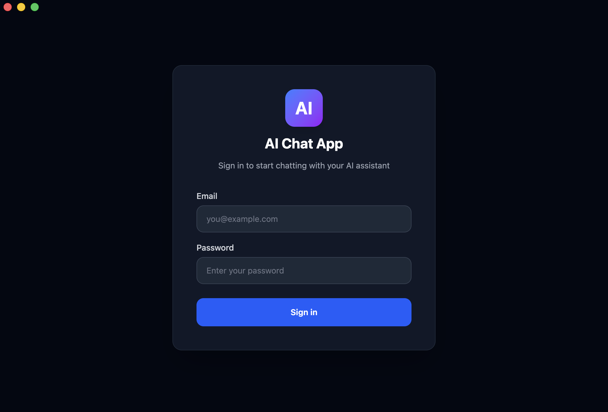
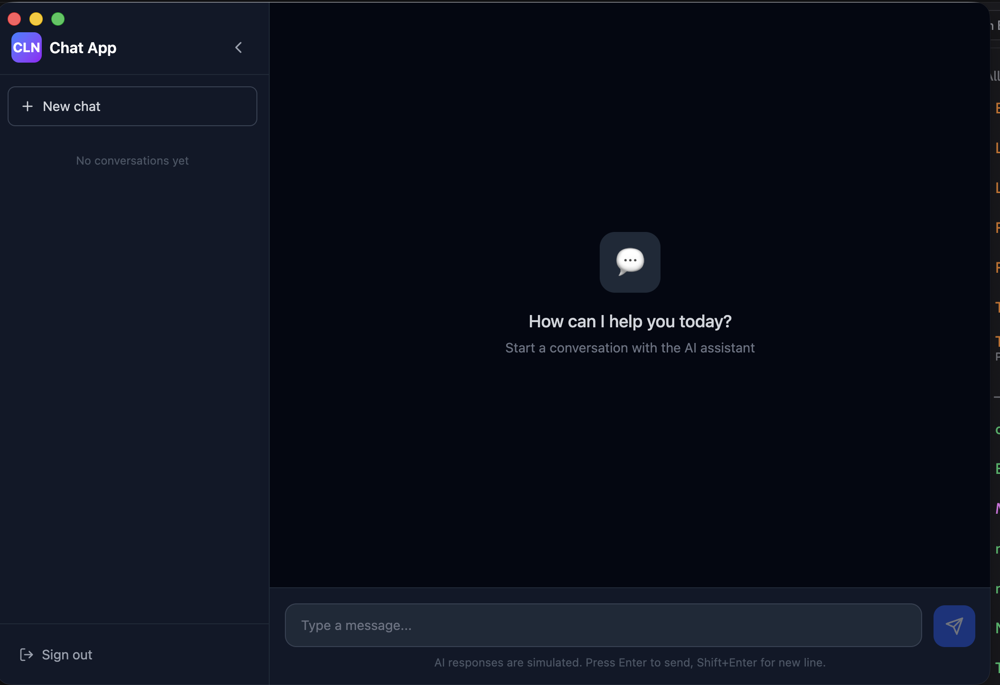

# electron-app-chat

A secure, production-ready AI Chat Desktop Application built with Electron, React, Vite, and TailwindCSS.

## Screenshots

### Login Screen



### Main Chat Screen



## Recommended IDE Setup

- [VSCode](https://code.visualstudio.com/) + [ESLint](https://marketplace.visualstudio.com/items?itemName=dbaeumer.vscode-eslint) + [Prettier](https://marketplace.visualstudio.com/items?itemName=esbenp.prettier-vscode)

## Google OAuth Setup

This app uses Google OAuth for authentication. You need a **Google Client ID** to enable the login flow.

### How to Get a Google Client ID

1. Go to the [Google Cloud Console](https://console.cloud.google.com/).
2. Create a new project (or select an existing one).
3. Navigate to **APIs & Services** → **Credentials**.
4. Click **+ CREATE CREDENTIALS** → **OAuth client ID**.
5. Select **Desktop app** as the application type.
6. Give it a name (e.g., `AI Chat Desktop`).
7. Click **Create**. Copy the **Client ID** shown in the dialog.
8. Under **Authorized redirect URIs**, add: `my-ai-chat://auth`

### Configure the Client ID

1. Copy the example environment file:
   ```bash
   cp .env.example .env
   ```
2. Open `.env` and replace the placeholder with your real Client ID:
   ```
   MAIN_VITE_GOOGLE_CLIENT_ID=your_real_google_client_id_here
   ```

> **Note:** The `.env` file is git-ignored. Never commit your real Client ID to version control.

## Project Setup

### Install

```bash
$ npm install
```

### Development

```bash
$ npm run dev
```

### Build

```bash
# For windows
$ npm run build:win

# For macOS
$ npm run build:mac

# For Linux
$ npm run build:linux
```

## Architecture

- **Main process** (`src/main/`) — Electron main process with secure IPC handlers, custom protocol deep linking (`my-ai-chat://`), and mock Gemini AI logic.
- **Preload** (`src/preload/`) — Strictly typed `contextBridge` API. No Node.js exposure to the renderer.
- **Renderer** (`src/renderer/`) — React UI with TailwindCSS. Login screen and ChatGPT-like chat interface.

### Security

- `nodeIntegration: false`
- `contextIsolation: true`
- `sandbox: true`
- All IPC communication goes through a typed preload bridge.
